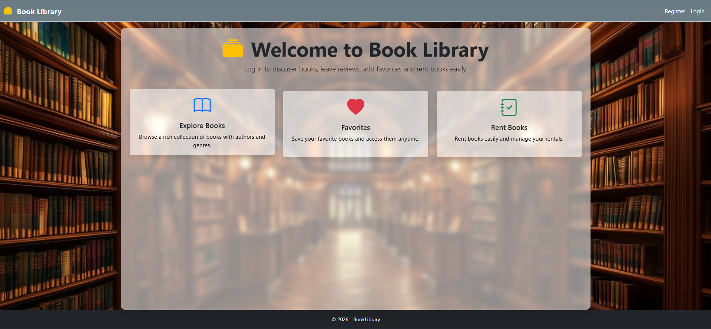
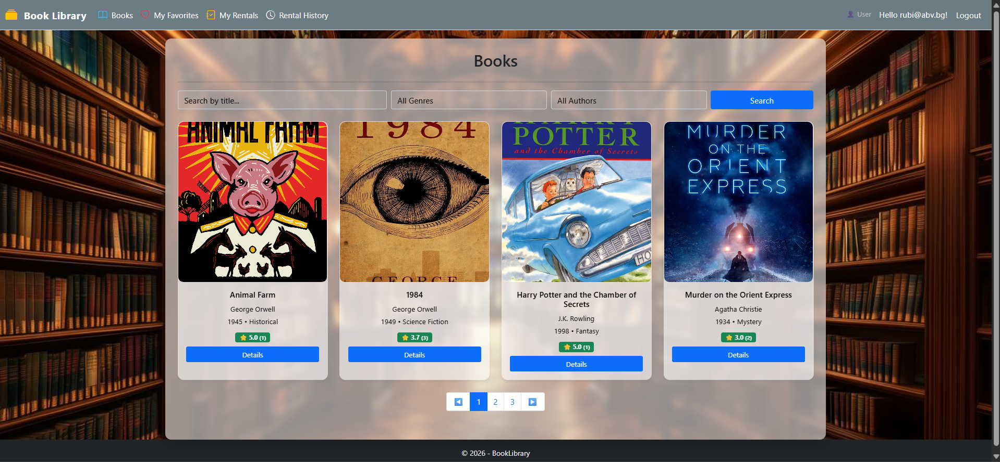
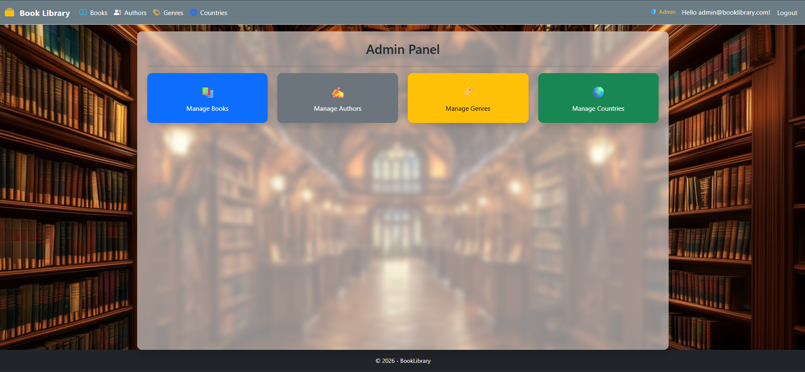

# 📚 Book Library

## 📖 About the Project

Book Library is a web application built with ASP.NET Core MVC
(.NET 8).\
It allows users to explore books, manage personal collections, write
reviews, and rent books.

The application demonstrates a clean architecture, separation of
concerns, and implementation of real-world business logic with a focus
on maintainability and scalability.

------------------------------------------------------------------------

## 🚀 Features

### 📚 Books
- Browse all books with pagination
- Search books by title
- Filter books by genre and author
- View detailed information for each book

### ❤️ Favorites
- Add and remove books from favorites
- Personal favorites list for each user

### 📦 Rentals
- Rent available books
- Return rented books

### 📜 Rental History
- View full rental history
- Pagination support
- Clear history functionality (preserves active rentals)

### ⭐ Reviews
- Add reviews to books
- Rating system (1–5)
- Reviews displayed in book details

### 🔐 Authentication & Roles
- User registration and login
- Role-based access (User / Admin)

### 🛠️ Admin Area
- Manage books, authors, genres and countries
- Separate admin area using ASP.NET MVC Areas

---

## ⚙️ Business Rules

- A book cannot be rented if it is already rented
- Only the user who rented a book can return it
- Active rentals cannot be removed when clearing history
- A book cannot be deleted if it is currently rented
- A country cannot be deleted if it is assigned to any author
- A genre cannot be deleted if it is assigned to any book
- An author cannot be deleted if they have associated books

------------------------------------------------------------------------

## 🏗️ Architecture

-   ASP.NET Core MVC
-   Service Layer
-   Entity Framework Core
-   ASP.NET Identity
-   Dependency Injection

------------------------------------------------------------------------

## 🧪 Testing

The business logic is covered with unit tests using: - xUnit - EF Core
InMemory Database

------------------------------------------------------------------------

## 🗄️ Database

-   Microsoft SQL Server
-   Entity Framework Core

------------------------------------------------------------------------

## 🔐 Authentication & Authorization

-   User registration and login
-   Roles: User / Administrator

### 🔑 Admin Credentials

Email: admin@booklibrary.com\
Password: Admin123!

------------------------------------------------------------------------

## ⚙️ How to Run the Project

1.  Clone the repository.
2.  Open the solution in Visual Studio.
3.  Open **appsettings.json** (or user secrets if configured).
4.  Replace the `DefaultConnection` connection string with your own
    local SQL Server connection string.

Example:

    "ConnectionStrings": {
      "DefaultConnection": "Server=YOUR_SERVER_NAME;Database=BookLibrary;Trusted_Connection=True;TrustServerCertificate=True;"
    }

5.  Open Package Manager Console and run:

    `Update-Database`

6.  Run the project.

------------------------------------------------------------------------

## 📸 Screenshots

### 🏠 Home Page

### 📚 Books Page

### 🛠️ Admin Panel

------------------------------------------------------------------------

## 🧰 Technologies

-   ASP.NET Core (.NET 8)
-   EF Core
-   SQL Server
-   Bootstrap
-   xUnit

------------------------------------------------------------------------

## 👨‍💻 Author

### Kristiyan Kamboshev

------------------------------------------------------------------------